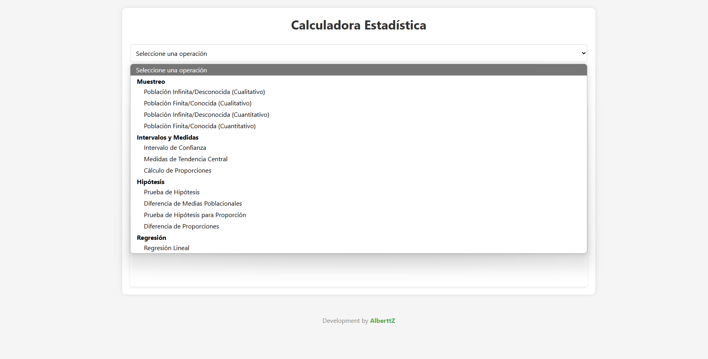

# Calculadora Estadística Web

Esta es una calculadora estadística desarrollada en HTML, CSS y JavaScript, pensada para facilitar el cálculo de operaciones estadísticas comunes tanto para estudiantes como para profesionales.

## Funcionalidades

- **Muestreo**
  - Población infinita o desconocida (cualitativo y cuantitativo)
  - Población finita o conocida (cualitativo y cuantitativo)
- **Intervalos y Medidas**
  - Intervalo de confianza
  - Medidas de tendencia central (media, mediana, moda)
  - Cálculo de proporciones
- **Hipótesis**
  - Prueba de hipótesis para media poblacional
  - Prueba de hipótesis para diferencia de medias
  - Prueba de hipótesis para proporción
  - Prueba de hipótesis para diferencia de proporciones
- **Regresión Lineal**
  - Diagrama de dispersión
  - Ecuación de la recta de regresión
  - Coeficiente de correlación
  - Método de mínimos cuadrados

## ¿Cómo usarla?

1. Clona o descarga este repositorio.
2. Abre el archivo `index.html` en tu navegador web favorito.
3. Selecciona la operación estadística que deseas realizar desde el menú desplegable.
4. Ingresa los datos requeridos en el formulario.
5. Haz clic en "Calcular" para ver los resultados numéricos y, cuando corresponda, gráficos.

## Captura de pantalla

## Contribuciones

¡Las contribuciones son bienvenidas! Si deseas mejorar la calculadora, corrige errores o agrega nuevas funcionalidades, puedes hacer un fork del repositorio y enviar un pull request.

## Créditos

Desarrollado por [Juan Alberto Aguilar](https://github.com/Albert-Z00Z)

---

**Development by AlberttZ** 